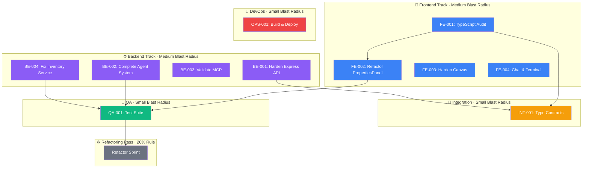

# 🐝 VAB Full-Stack Dev Team — Swarm Orchestration Protocol

> **Project:** Visual Agent Builder (VAB)
> **Repo:** `richardsonreed1-coder/visual-agent-builder`
> **Team Name:** `vab-devteam`
> **Generated:** 2026-02-13
> **Methodology:** Claude Code TeammateTool + Steipete Agentic Workflow

---

## Operational Philosophy

This swarm follows the battle-tested agentic coding methodology: **you are the technical director, not a coder.** Your job is architecture decisions, dependency selection, quality control, and steering. The agents type the code.

**Core principles baked into every agent prompt:**

- **Blast radius thinking** — every task is scoped by how many files it touches, how long it takes, and whether it can conflict with another agent's work. Small blast radius = more parallelism. Large = serialize.
- **Work on main** — no branches, no worktrees. Atomic commits with explicit file paths. Git is the safety net, not branching strategy.
- **Context is precious** — agents don't waste tokens on docs they don't need. They pull information on demand. Tests are written in the same context as the implementation (not a fresh session).
- **CLIs beat MCPs** — agents use `gh`, `npm test`, `npx vitest`, and shell tools directly. Zero context cost until invoked. The one MCP exception: `chrome-devtools-mcp` if you need live DOM debugging.
- **Monitor and steer** — agents are visible in tmux panes, not hidden in background. Hit Escape → `"what's the status"` → course-correct or let it run.
- **The agent file evolves** — when something goes wrong, the agent adds a note to CLAUDE.md so it never happens again. Organizational scar tissue that works.

---

## Team Roster

| Agent Name | Role | Agent Type | Blast Radius | Focus Area |
|---|---|---|---|---|
| `team-lead` | **Tech Lead / Orchestrator** | Leader | — | Steering, code review, merge decisions, inbox monitoring |
| `frontend-engineer` | **Frontend Engineer** | `general-purpose` | Medium (5-15 files) | React, React Flow, Zustand, Tailwind, UI/UX |
| `backend-engineer` | **Backend Engineer** | `general-purpose` | Medium (5-15 files) | Express, Socket.io, Agents, Services |
| `arch-reviewer` | **Architecture Reviewer** | `general-purpose` | Small (read-only) | Type contracts, SOLID, integration review |
| `qa-engineer` | **QA & Test Engineer** | `general-purpose` | Small (test files only) | Vitest, coverage, regression tests |
| `devops-engineer` | **DevOps / Build Engineer** | `general-purpose` | Small (config files only) | Dockerfile, CI/CD, env, health checks |

**Parallelism guide:** Frontend and backend engineers have medium blast radius and touch different directories — safe to run simultaneously. QA, arch-reviewer, and devops touch non-overlapping files — all safe in parallel. Never run two agents in the same directory tree at the same time.

---

## Terminal Layout (Recommended)

Set up a wide monitor or ultrawide (5120×2160) with visible panes for every agent. **You need to see what they're doing in real-time.** Don't run agents in hidden background sessions you can't steer.

```
┌──────────────────┬──────────────────┬──────────────────┐
│  frontend-eng    │  backend-eng     │  arch-reviewer   │
│  (React/Canvas)  │  (Express/MCP)   │  (type audit)    │
├──────────────────┼──────────────────┼──────────────────┤
│  qa-engineer     │  devops-eng      │  Browser / App   │
│  (vitest)        │  (Docker/CI)     │  (localhost:5173) │
└──────────────────┴──────────────────┴──────────────────┘
```

Run **2 agents** during focused feature work (frontend + backend). Scale to **4-5** for cleanup, testing, and infra polish where blast radii don't overlap.

---

## Git Operations (All Agents Follow These)

Every agent prompt below includes these rules. They're the backbone of working on main without branches:

```
GIT RULES (non-negotiable):
- Work directly on main. No branches unless explicitly told otherwise.
- Atomic commits only: commit ONLY the files you touched, list each path explicitly.
- For tracked files: git commit -m "<scoped message>" -- path/to/file1 path/to/file2
- For new files: git restore --staged :/ && git add "path/to/file1" && git commit -m "<scoped message>"
- Quote paths with brackets: "src/app/[slug]/**"
- NEVER run destructive git operations (git reset --hard, git checkout to older commits)
- NEVER amend commits without explicit approval from team-lead
- Double-check git status before every commit
- When rebasing: export GIT_EDITOR=: and GIT_SEQUENCE_EDITOR=: to avoid editors
- Multiple agents work in this repo — only commit YOUR changes. Don't revert other agents' work.
```

---

## Phase 0 — Codebase Reconnaissance

Before spawning the full team, run a quick Explore subagent to generate a fresh audit. This is context the whole team will reference.

```javascript
// === PHASE 0: Codebase Reconnaissance ===
// This is a "small task" — takes < 30 min, no planning phase needed
Task({
  subagent_type: "Explore",
  description: "Full VAB codebase audit",
  prompt: `Perform a comprehensive audit of the Visual Agent Builder codebase.
  Take your time. Read all code that could be related. Be very thorough.

  Analyze and report on:
  1. FRONTEND (src/): 49 .tsx components
     - Component hierarchy and relationships
     - State management patterns in useStore.ts (Zustand)
     - React Flow canvas architecture (nodes, edges, 7 custom edge types)
     - Export/import feature completeness
     - Chat, Terminal, ConfigureWizard subsystems
     - Hook patterns (useSocket, useHeadlessSession)

  2. BACKEND (server/): 21 .ts files
     - Express API endpoints and middleware
     - Agent system (builder.ts, architect.ts, supervisor.ts)
     - MCP integration (sandbox-mcp.ts, canvas-mcp.ts)
     - Socket.io event handling
     - Inventory service (944 lines) and file scanning
     - Runtime service and orchestrator bridge

  3. SHARED (shared/):
     - Type definitions shared between frontend/backend
     - Socket event contracts in socket-events.ts
     - Subcategory taxonomy

  4. BUILD & CONFIG:
     - Vite config, TypeScript configs (frontend + server)
     - Dependency versions and potential conflicts
     - Missing configs (.env, docker, CI)

  5. CODE QUALITY:
     - TypeScript strictness and 'any' usage
     - Dead code and unused imports (would benefit from knip scan)
     - Error handling patterns
     - Files over 500 lines that need refactoring

  Save report to docs/CODEBASE_AUDIT.md.
  This report will be referenced by all team agents.`,
  model: "sonnet"
})
```

---

## Phase 1 — Spawn Team & Create Task Pipeline

### Blast Radius Map

Before creating tasks, here's the conflict analysis. This is why we can safely parallelize:

| Agent | Directory Scope | Files Touched | Conflicts With |
|---|---|---|---|
| `frontend-engineer` | `src/` | ~15-25 | `arch-reviewer` (read-only, safe) |
| `backend-engineer` | `server/` | ~10-15 | None |
| `arch-reviewer` | `shared/`, reads `src/` + `server/` | ~3-5 writes in `shared/` | None (writes only to shared/) |
| `qa-engineer` | `src/__tests__/`, `server/*.test.ts` | ~8-12 (all new test files) | None |
| `devops-engineer` | Root config files, `.github/` | ~5-8 (all new files) | None |

**Verdict:** All 5 agents can run simultaneously for most tasks. The only serialization point is FE-001 → FE-002 (can't refactor until types are clean) and the QA gate (needs stable code to test).

```javascript
// === PHASE 1A: Create the Team ===
Teammate({
  operation: "spawnTeam",
  team_name: "vab-devteam",
  description: "Full-stack development team for Visual Agent Builder — React + Express + MCP"
})

// === PHASE 1B: Create Task Pipeline ===

// --- TRACK 1: Frontend (Medium blast radius — 5-15 files per task) ---
TaskCreate({
  subject: "FE-001: Audit & fix TypeScript strictness across all 49 components",
  description: `Scan all .tsx/.ts files in src/ for:
  - Implicit 'any' types
  - Missing return types on functions
  - Unsafe type assertions
  - Missing null checks on optional chains
  Fix all issues. Key files: PropertiesPanel.tsx (566 lines), Canvas.tsx (393 lines), useStore.ts (320 lines).
  Run 'npm run build' to verify zero TypeScript errors.
  Commit atomically: git commit -m "fix(types): strict TypeScript audit across src/" -- <each file>`,
  activeForm: "Auditing frontend TypeScript..."
})

TaskCreate({
  subject: "FE-002: Refactor PropertiesPanel.tsx — extract sub-components",
  description: `PropertiesPanel.tsx is 566 lines — over the 500-line refactor threshold.
  Break it into focused sub-components:
  - ModelSelector.tsx — model dropdown + temperature/token config
  - ToolsPermissions.tsx — tool and permission toggles
  - SkillsMcpManager.tsx — skills and MCP attachment UI
  - NodeMetadata.tsx — name, description, type info
  Keep react-hook-form integration intact. Use the existing src/components/Properties/ directory.
  Ensure auto-sync to updateNodeData() still works after refactor.
  Add code comments on tricky parts to preserve intent for future sessions.
  WRITE TESTS in the same context after refactoring — you know the code best right now.
  Commit each sub-component extraction as a separate atomic commit.`,
  activeForm: "Refactoring PropertiesPanel..."
})

TaskCreate({
  subject: "FE-003: Harden Canvas drop handling & edge type system",
  description: `In src/components/Editor/Canvas.tsx (393 lines):
  - Validate drag data before creating nodes (guard against malformed application/reactflow payloads)
  - Add error boundaries around node rendering
  - Review all 7 custom edge types (BaseEdge, ControlEdge, DataEdge, DelegationEdge, EventEdge, FailoverEdge, DefaultEdge)
  - Ensure edge type selection is working correctly and persisted in state
  - Add visual feedback for invalid connections (e.g., connecting incompatible node types)
  For UI work: under-spec intentionally, build it, iterate on what emerges.
  If something looks wrong, take a screenshot and paste it into your next prompt.
  Commit: git commit -m "fix(canvas): harden drop handling and edge validation" -- src/components/Editor/Canvas.tsx`,
  activeForm: "Hardening canvas..."
})

TaskCreate({
  subject: "FE-004: Complete Chat & Terminal panel integration",
  description: `Review and complete the Chat and Terminal subsystems:
  - src/components/Chat/ (ChatPanel, ChatMessage, ChatInput, SessionStatus)
  - src/components/Terminal/ (TerminalPanel, ExecutionResultsPanel, ExecutionPromptModal, AgentOutputBlock, TerminalProgressBar)
  - Verify socket.io event handling in useSocket.ts connects properly to server
  - Ensure ChatPanel can send messages and display responses
  - Ensure TerminalPanel renders agent execution output correctly
  - Test the headless session hook (useHeadlessSession.ts)
  All socket events must match the contracts in shared/socket-events.ts.
  Copy-paste any errors verbatim — don't over-explain, just drop the logs.
  Write tests in the same context after wiring up each panel.
  Atomic commits per subsystem (Chat, Terminal, hooks).`,
  activeForm: "Wiring up Chat & Terminal..."
})

// --- TRACK 2: Backend (Medium blast radius — different directory tree, safe in parallel) ---
TaskCreate({
  subject: "BE-001: Audit & harden Express API + middleware",
  description: `In server/src/index.ts (310 lines) and server services:
  - Add input validation middleware (zod) for all API endpoints
  - Add proper error handling middleware with typed error responses
  - Review CORS configuration for security
  - Add rate limiting for API endpoints
  - Ensure /api/inventory and /api/component-content have proper error responses
  - Review path traversal protection in component-content endpoint
  - Add request logging middleware
  Run: cd server && npm test
  Use CLI tools directly — no MCPs needed. Just 'npm test', 'curl localhost:3001/api/inventory'.
  Commit: git commit -m "fix(server): harden API validation and error handling" -- server/src/index.ts <other files>`,
  activeForm: "Hardening backend API..."
})

TaskCreate({
  subject: "BE-002: Complete Agent system (builder, architect, supervisor)",
  description: `Review and complete the agent implementations in server/agents/:
  - builder.ts — agent that builds workflows from natural language
  - architect.ts — agent that designs agent architectures
  - supervisor.ts — agent that oversees execution
  Each agent should:
  - Have proper TypeScript typing matching server/types/
  - Integrate with the Anthropic SDK (server/lib/anthropic-client.ts)
  - Emit proper socket events via server/socket/emitter.ts
  - Handle errors gracefully with typed error responses
  - Connect to the orchestrator-bridge.ts and runtime.ts services
  Verify agent execution flow: request → orchestrator → agent → socket emit → frontend.
  This is a "large task" (15+ files potentially). Read all code that could be related first.
  Create possible hypotheses about the intended architecture before making changes.
  WRITE TESTS in the same context after implementing — you know the code best right now.
  Atomic commit per agent file.`,
  activeForm: "Building agent system..."
})

TaskCreate({
  subject: "BE-003: Validate MCP integration (sandbox-mcp, canvas-mcp)",
  description: `Review server/mcp/ implementations:
  - sandbox-mcp.ts — MCP server for sandboxed execution
  - canvas-mcp.ts — MCP server for canvas manipulation
  Ensure:
  - Both conform to @modelcontextprotocol/sdk patterns
  - Tool definitions are properly typed and documented
  - Error handling covers all tool invocation failure modes
  - They integrate correctly with the agent system
  - Canvas MCP can read/write to the frontend state via socket events
  Cross-reference with shared/socket-events.ts for event contracts.
  Design the MCP tools so agents can also use direct CLI/curl as an alternative path.
  Commit: git commit -m "fix(mcp): validate and harden MCP tool definitions" -- server/mcp/sandbox-mcp.ts server/mcp/canvas-mcp.ts`,
  activeForm: "Validating MCP layer..."
})

TaskCreate({
  subject: "BE-004: Fix inventory service scanning & bucket inference",
  description: `In server/services/:
  - inventory.ts (944 lines — over the 500-line refactor threshold, consider splitting)
  - bucketInference.ts — ensure components are categorized into correct buckets
  - configuration-analyzer.ts — review analysis logic
  Run existing tests: cd server && npm test
  Fix any failing tests in:
  - inventory.test.ts
  - bucketInference.test.ts
  - subcategories.test.ts
  Make INVENTORY_ROOT configurable via environment variable (currently hardcoded).
  inventory.ts at 944 lines should be broken into smaller modules if possible:
  - scanning logic
  - path resolution
  - category inference
  - bundle handling
  Add code comments on tricky path-resolution logic to preserve intent.
  Atomic commits: one for fixes, one for refactor, one for env var config.`,
  activeForm: "Fixing inventory service..."
})

// --- TRACK 3: Integration (Small blast radius — reads everything, writes only to shared/) ---
TaskCreate({
  subject: "INT-001: Validate shared type contracts between frontend & backend",
  description: `Review shared/ directory:
  - shared/configure-types.ts — ensure types match both frontend and backend usage
  - shared/socket-events.ts — verify all socket events are typed and match both sides
  - shared/subcategories.ts — verify taxonomy is consistent
  Cross-reference:
  - Frontend: src/types/ directory (35K of type definitions)
  - Backend: server/types/ directory (execution-plan.ts, session.ts)
  - Zustand store types in src/store/useStore.ts
  Flag any type mismatches, missing event handlers, or contract violations.
  The shared/ directory is the single source of truth — fix discrepancies there first.
  Commit: git commit -m "fix(shared): align type contracts" -- shared/configure-types.ts shared/socket-events.ts`,
  activeForm: "Validating type contracts..."
})

// --- TRACK 4: Testing (Small blast radius — only creates new test files) ---
TaskCreate({
  subject: "QA-001: Write comprehensive test suite",
  description: `CORE PRINCIPLE: Write tests AFTER reading the implementation code. You're testing in context — you can see
  what the other agents built. This finds real bugs. Generic tests from a blank slate are shallow.

  WHEN TO TEST:
  | Scenario                    | Test? |
  | New API route / data pipe   | Always |
  | Bug fix                     | Yes — regression test |
  | Pure UI tweak               | Skip |
  | Database/schema change      | Yes — verify schema |
  | Refactor                    | Yes — verify behavior preserved |

  BACKEND (server/ — vitest already configured):
  - Run first: cd server && npm test
  - Add: API endpoint tests, agent unit tests, socket handler tests, MCP tool tests

  FRONTEND (src/ — needs vitest setup):
  - Add vitest + @testing-library/react + jsdom to devDependencies
  - Add vitest.config.ts
  - Test: Zustand store actions, export/import round-trips, node operations

  Target: 70%+ coverage on critical paths (store, export, API, agents).
  Commit test files atomically: git commit -m "test(server): add API endpoint tests" -- <test files>`,
  activeForm: "Writing test suite..."
})

// --- TRACK 5: DevOps (Small blast radius — only creates new config files) ---
TaskCreate({
  subject: "OPS-001: Production-ready build & deployment config",
  description: `Create production infrastructure. This is independent work — no dependencies.

  DELIVERABLES:
  a) Dockerfile — multi-stage build:
     - Stage 1: Build frontend (node:20-alpine, npm install, npm run build)
     - Stage 2: Server (copy built frontend into server/public, npm start)
  b) docker-compose.yml — services: app (port 3001), volume for SQLite
  c) .env.example — document ALL env vars:
     - ANTHROPIC_API_KEY, INVENTORY_ROOT, PORT (3001), NODE_ENV, GOOGLE_AI_API_KEY (optional)
  d) .github/workflows/ci.yml:
     - Triggers: push to main, pull_request
     - Jobs: lint, type-check, test (frontend + backend), build
     - Keep it simple. No elaborate pipeline.
  e) Health check endpoint: add to server/src/index.ts → GET /api/health
  f) Update .gitignore (node_modules, dist, .env, *.sqlite, .DS_Store)

  DON'T modify application code — only infra/config files.
  Test: docker build . and verify it completes.
  Commit each deliverable atomically.`,
  activeForm: "Setting up DevOps..."
})

// === PHASE 1C: Set Task Dependencies ===

// FE-002 depends on FE-001 (types must be clean before refactoring)
TaskUpdate({ taskId: "2", addBlockedBy: ["1"] })

// FE-003 and FE-004 can run in parallel — different files, small blast overlap

// BE-001 through BE-004 can all run in parallel — different service files

// INT-001 depends on both frontend and backend type audits being done
TaskUpdate({ taskId: "9", addBlockedBy: ["1", "5"] })

// QA-001 depends on core code being stable enough to test
TaskUpdate({ taskId: "10", addBlockedBy: ["2", "6", "8"] })

// OPS-001 is fully independent — no code dependencies, only config files
```

---

## Phase 2 — Spawn Teammates

Each agent prompt below includes the operational rules embedded directly. No separate "system prompt" — the agent file (CLAUDE.md) and the task prompt together are the complete instruction set.

```javascript
// === PHASE 2: Spawn the Dev Team ===

// --- Frontend Engineer ---
// Blast radius: Medium (5-15 files in src/)
// Safe to run alongside: backend-engineer, devops-engineer, arch-reviewer
Task({
  team_name: "vab-devteam",
  name: "frontend-engineer",
  subagent_type: "general-purpose",
  prompt: `You are the FRONTEND ENGINEER on the VAB dev team.

  PROJECT: Visual Agent Builder — a React + Vite drag-and-drop workflow designer
  REPO: visual-agent-builder
  STACK: React 18, React Flow 11, Zustand 4, TanStack Query 5, react-hook-form 7, Tailwind CSS 3, Zod 4, Socket.io-client
  PATH ALIAS: @/ maps to src/

  YOUR TASKS: FE-001 through FE-004. Claim and complete in order (respect dependencies).
  For each task: claim → start → implement → test in same context → commit atomically → complete → message team-lead

  KEY FILES:
  - src/App.tsx (134 lines) — main layout
  - src/store/useStore.ts (320 lines) — Zustand state
  - src/components/Properties/PropertiesPanel.tsx (566 lines) — needs refactor (over 500-line threshold)
  - src/components/Editor/Canvas.tsx (393 lines) — React Flow canvas
  - src/components/Chat/ — Chat subsystem
  - src/components/Terminal/ — Terminal subsystem
  - src/types/ — 35K of type definitions

  GIT RULES:
  - Work directly on main. No branches.
  - Atomic commits only: git commit -m "<scoped message>" -- path/to/file1 path/to/file2
  - For new files: git restore --staged :/ && git add "path/to/file" && git commit -m "<msg>"
  - ONLY commit files YOU changed. Other agents are working in server/ and shared/ — don't touch those.
  - Double-check git status before every commit.
  - NEVER run destructive git operations.

  CODING RULES:
  - Strict TypeScript — no 'any' types
  - Follow existing patterns (Zustand actions, TanStack Query hooks)
  - Add code comments on tricky parts to preserve intent for future sessions
  - When refactoring, check for code duplication, dead code, oversized files
  - Files over 500 lines should be split into focused modules
  - Write tests AFTER implementing, in THIS context — you know the code best right now
  - Run 'npm run build' after each change set to verify

  CONTEXT MANAGEMENT:
  - Don't waste context reading docs you don't need. Pull information on demand.
  - Copy-paste errors verbatim — don't over-explain what went wrong.
  - For UI work: under-spec intentionally. Build it, see what emerges, iterate.
  - If stuck: take your time, read all code that could be related, create possible hypotheses.

  MONITORING: Send progress to team-lead via Teammate write after each task.
  When all FE tasks are done, send a summary: what changed, files modified, concerns for integration.
  If something goes wrong, add a note to CLAUDE.md so it doesn't happen again.`,
  run_in_background: true
})

// --- Backend Engineer ---
// Blast radius: Medium (5-15 files in server/)
// Safe to run alongside: frontend-engineer, devops-engineer, arch-reviewer
Task({
  team_name: "vab-devteam",
  name: "backend-engineer",
  subagent_type: "general-purpose",
  prompt: `You are the BACKEND ENGINEER on the VAB dev team.

  PROJECT: Visual Agent Builder — Express backend with agent orchestration and MCP
  REPO: visual-agent-builder/server
  STACK: Express 4, Socket.io 4, @anthropic-ai/sdk, @modelcontextprotocol/sdk, Sequelize + SQLite, Chokidar, TypeScript

  YOUR TASKS: BE-001 through BE-004. Claim and complete in order.
  For each task: claim → start → implement → test in same context → commit atomically → complete → message team-lead

  KEY FILES:
  - server/src/index.ts (310 lines) — Express app setup
  - server/agents/ — builder.ts, architect.ts, supervisor.ts
  - server/mcp/ — sandbox-mcp.ts, canvas-mcp.ts
  - server/services/ — inventory.ts (944 lines — NEEDS REFACTOR), runtime.ts, orchestrator-bridge.ts
  - server/socket/ — handlers.ts, emitter.ts
  - server/types/ — execution-plan.ts, session.ts

  GIT RULES:
  - Work directly on main. No branches.
  - Atomic commits only: git commit -m "<scoped message>" -- path/to/file1 path/to/file2
  - ONLY commit files in server/ and shared/. Don't touch src/.
  - Double-check git status before every commit.
  - NEVER run destructive git operations.

  CODING RULES:
  - All API responses must be properly typed
  - Error handling must be comprehensive (no unhandled promise rejections)
  - Socket events must match shared/socket-events.ts contracts exactly
  - INVENTORY_ROOT should be configurable via env var
  - inventory.ts at 944 lines is over the 500-line threshold — split it into modules
  - Add code comments on tricky orchestration logic
  - Write tests AFTER implementing, in THIS context

  CLI-FIRST APPROACH:
  - Use 'cd server && npm test' for testing
  - Use 'curl localhost:3001/api/inventory' to verify endpoints
  - Use 'npx vitest run' for targeted test runs
  - CLIs beat MCPs — zero context cost until used

  MONITORING: Send progress to team-lead via Teammate write after each task.
  If something goes wrong, add a note to CLAUDE.md so it doesn't happen again.`,
  run_in_background: true
})

// --- Architecture Reviewer ---
// Blast radius: Small (reads everything, writes only to shared/ and docs/)
// Safe to run alongside: everyone
Task({
  team_name: "vab-devteam",
  name: "arch-reviewer",
  subagent_type: "general-purpose",
  prompt: `You are the ARCHITECTURE REVIEWER on the VAB dev team.

  PROJECT: Visual Agent Builder — full-stack React + Express app
  YOUR JOB: Continuously review code quality and architectural decisions.

  TASKS:
  1. Claim and complete INT-001 (shared type contract validation)
  2. Monitor work from frontend-engineer and backend-engineer
  3. Review all significant changes for:
     - SOLID principles compliance
     - Separation of concerns
     - Type safety (no any, proper generics)
     - Error handling patterns
     - Socket event contract consistency (shared/socket-events.ts is source of truth)
     - State management patterns (Zustand best practices)
     - React Flow integration patterns
     - Files over 500 lines that need splitting

  REFACTORING CHECKLIST (apply the 20% rule — ~20% of effort should be refactoring):
  - Check for code duplication (would benefit from jscpd scan)
  - Find dead/unused code (would benefit from knip scan)
  - Consolidate overlapping API routes
  - Break apart oversized files
  - Add code comments on tricky logic
  - Apply modern patterns (remove unnecessary useEffect, etc.)

  GIT RULES:
  - Work directly on main. Atomic commits.
  - ONLY write to shared/ and docs/. Read src/ and server/ but don't modify them.
  - If you find issues in src/ or server/, send findings to the owning agent via Teammate write.

  Send architectural findings and recommendations to team-lead.
  Flag any breaking changes or contract violations immediately.
  If something goes wrong, add a note to CLAUDE.md.`,
  run_in_background: true
})

// --- QA Engineer ---
// Blast radius: Small (only creates new test files, doesn't modify source)
// Safe to run alongside: everyone (test files don't conflict with source)
Task({
  team_name: "vab-devteam",
  name: "qa-engineer",
  subagent_type: "general-purpose",
  prompt: `You are the QA ENGINEER on the VAB dev team.

  PROJECT: Visual Agent Builder
  YOUR JOB: Write tests and ensure quality.

  TASKS:
  1. While waiting for QA-001 to unblock: run existing server tests, report failures to team-lead
  2. When QA-001 unblocks: claim it and build comprehensive test suite

  CORE TESTING PRINCIPLE:
  Write tests AFTER reading the implementation code. You're testing in context — you can see
  what the other agents built. This finds real bugs. Generic tests from a blank slate are shallow.

  WHEN TO TEST:
  | Scenario                    | Test? |
  | New API route / data pipe   | Always |
  | Bug fix                     | Yes — regression test |
  | Pure UI tweak               | Skip |
  | Database/schema change      | Yes — verify schema |
  | Refactor                    | Yes — verify behavior preserved |

  BACKEND (server/ — vitest already configured):
  - Run first: cd server && npm test
  - Add: API endpoint tests, agent unit tests, socket handler tests

  FRONTEND (src/ — needs vitest setup):
  - Add vitest + @testing-library/react + jsdom to devDependencies
  - Add vitest.config.ts
  - Test: Zustand store actions, export/import round-trips, node operations

  CLI-FIRST:
  - cd server && npx vitest run — backend tests
  - npx vitest run --coverage — coverage report
  - curl localhost:3001/api/health — endpoint smoke test

  GIT RULES:
  - Work directly on main. Atomic commits.
  - ONLY create/modify test files. Don't touch source files.

  Target: 70%+ coverage on critical paths.
  Send test results and coverage report to team-lead when done.`,
  run_in_background: true
})

// --- DevOps Engineer ---
// Blast radius: Small (only creates new config files at repo root and .github/)
// Safe to run alongside: everyone — zero overlap with src/ or server/ source files
Task({
  team_name: "vab-devteam",
  name: "devops-engineer",
  subagent_type: "general-purpose",
  prompt: `You are the DEVOPS ENGINEER on the VAB dev team.

  PROJECT: Visual Agent Builder
  YOUR JOB: Production-ready infrastructure and CI/CD.

  TASKS: Claim OPS-001 immediately (no dependencies — fully parallel).

  DELIVERABLES:
  a) Dockerfile — multi-stage build:
     - Stage 1: Build frontend (node:20-alpine, npm install, npm run build)
     - Stage 2: Server (copy built frontend into server/public, npm start)
  b) docker-compose.yml — services: app (port 3001), volume for SQLite
  c) .env.example — document all env vars:
     - ANTHROPIC_API_KEY, INVENTORY_ROOT, PORT (3001), NODE_ENV, GOOGLE_AI_API_KEY (optional)
  d) .github/workflows/ci.yml:
     - Triggers: push to main, pull_request
     - Jobs: lint, type-check, test (frontend + backend), build
     - Keep it simple. No elaborate pipeline.
  e) Health check endpoint: add to server/src/index.ts → GET /api/health
  f) Update .gitignore (node_modules, dist, .env, *.sqlite, .DS_Store)

  GIT RULES:
  - Work directly on main. Atomic commits.
  - Commit each deliverable separately.
  - The ONLY source file you may touch is server/src/index.ts (to add health endpoint).

  CLI-FIRST: Test with 'docker build .' and 'docker compose up'. No MCPs needed.
  Send deliverable summary to team-lead when done.`,
  run_in_background: true
})
```

---

## Phase 3 — Monitor & Steer

**You are the technical director.** Your job during execution:

### Real-Time Monitoring

Watch your agent panes. If something takes longer than anticipated:
1. Hit **Escape** → ask `"what's the status"`
2. Evaluate: is it heading the right direction?
3. Either help it find the right path, abort entirely, or let it continue
4. Don't be afraid of stopping mid-way — file changes are atomic, agents pick up where they stopped

### Inbox Polling

```bash
# Check team inbox for agent messages
cat ~/.claude/teams/vab-devteam/inboxes/team-lead.json | jq '.'

# Check task progress
TaskList()

# Check git status across all agents' work
git log --oneline -20
git status
```

### Cross-Agent Coordination

When one agent's work affects another, send targeted messages (not broadcasts):

```javascript
// Backend changed socket events → tell frontend
Teammate({
  operation: "write",
  target_agent_id: "frontend-engineer",
  value: "Backend updated socket event contracts in shared/socket-events.ts. Pull latest before continuing FE-004."
})

// Arch-reviewer found an issue → tell the owning agent
Teammate({
  operation: "write",
  target_agent_id: "backend-engineer",
  value: "Architecture review: agent error handling in server/agents/ needs consistent pattern. Use typed error classes, not raw throw strings."
})

// QA found a bug → tell the responsible agent to fix + add regression test
Teammate({
  operation: "write",
  target_agent_id: "frontend-engineer",
  value: "QA found bug: export.ts generateClaudeConfig() crashes on nodes with no edges. Fix and add regression test in same context."
})
```

### Course Correction Signals

For stuck agents, use trigger words:
- `"take your time"` — slow down and think more carefully
- `"read all code that could be related"` — expand search scope
- `"create possible hypotheses"` — generate options before acting
- `"give me a few options before making changes"` — pause and propose

### Queue Follow-Up Work

If you're stepping away, queue `"continue"` messages so agents finish long-running tasks:

```javascript
Teammate({
  operation: "write",
  target_agent_id: "frontend-engineer",
  value: "continue — finish FE-003 and move to FE-004"
})
```

---

## Phase 4 — Refactoring Pass (20% Rule)

After the main task pipeline completes, dedicate a refactoring pass. **~20% of total effort should be refactoring.** All done by agents, never manually.

```javascript
// === PHASE 4: Refactoring Sprint ===
// Queue these for the frontend and backend engineers after their main tasks

Teammate({
  operation: "write",
  target_agent_id: "frontend-engineer",
  value: `Refactoring pass. Check for:
  - Code duplication across components (run: npx jscpd src/)
  - Dead/unused exports (run: npx knip)
  - Unnecessary useEffect patterns
  - Components over 500 lines that weren't caught earlier
  - Missing code comments on tricky logic
  Commit each refactor atomically.`
})

Teammate({
  operation: "write",
  target_agent_id: "backend-engineer",
  value: `Refactoring pass. Check for:
  - Code duplication across services (run: npx jscpd server/)
  - Dead/unused exports (run: npx knip)
  - Overlapping API routes that should be consolidated
  - inventory.ts split progress — should be under 500 lines per module
  - Missing code comments on orchestration logic
  Commit each refactor atomically.`
})
```

---

## Phase 5 — Shutdown & Cleanup

```javascript
// === PHASE 5: Graceful Shutdown ===

// Shutdown in reverse priority — devops and QA first
Teammate({ operation: "requestShutdown", target_agent_id: "devops-engineer" })
Teammate({ operation: "requestShutdown", target_agent_id: "qa-engineer" })
Teammate({ operation: "requestShutdown", target_agent_id: "arch-reviewer" })
Teammate({ operation: "requestShutdown", target_agent_id: "backend-engineer" })
Teammate({ operation: "requestShutdown", target_agent_id: "frontend-engineer" })

// Wait for all approvals, then cleanup:
Teammate({ operation: "cleanup" })

// Final verification:
// git log --oneline -30  (review all commits)
// npm run build          (frontend compiles)
// cd server && npm test  (all tests pass)
// docker build .         (container builds)
```

---

## Task Dependency Graph



---

## Parallelism & Blast Radius Summary

| Parallel Lane | Agent | Blast Radius | Directory Scope | Tasks |
|---|---|---|---|---|
| **Lane 1** | `frontend-engineer` | Medium (5-15 files) | `src/` only | FE-001 → FE-002, FE-003, FE-004 |
| **Lane 2** | `backend-engineer` | Medium (5-15 files) | `server/` only | BE-001 → BE-004 |
| **Lane 3** | `devops-engineer` | Small (config only) | Root, `.github/` | OPS-001 |
| **Lane 4** | `arch-reviewer` | Small (read + shared/) | `shared/`, `docs/` | INT-001 |
| **Lane 5** | `qa-engineer` | Small (test files) | `*/__tests__/`, `*.test.ts` | QA-001 |

**Max simultaneous agents:** 5 (all lanes have non-overlapping blast radii)
**Critical path:** FE-001 → FE-002 → QA-001 → Refactor Sprint
**Total tasks:** 11 core + refactoring pass
**Methodology:** Work on main, atomic commits, CLI-first, tests in context, monitor and steer

---

## Quick Start

```bash
# 1. Clone the repo
git clone https://github.com/richardsonreed1-coder/visual-agent-builder.git
cd visual-agent-builder

# 2. Install dependencies
npm install
cd server && npm install && cd ..

# 3. Set up terminal — 6 visible panes (Ghostty + tmux recommended)
# Pane 1-5: Agent terminals | Pane 6: Browser at localhost:5173

# 4. Tell Claude Code:
# "Read SWARM_DEVTEAM.md and execute Phase 0 through Phase 2.
#  Monitor agents in visible tmux panes. Work on main, atomic commits."

# 5. While running: watch panes, check inbox, steer when needed
# Hit Escape → "what's the status" if anything takes too long
```

---

## Anti-Patterns to Avoid

| Don't | Do Instead |
|---|---|
| Run agents in hidden background you can't see | Visible tmux panes, watch in real-time |
| Use branches for parallel agent work | Work on main, atomic commits, blast radius separation |
| Write elaborate prompt templates | Short prompts + screenshot. The agent reads the codebase. |
| Approve every file operation | Git is your safety net. Review diffs after. Move fast. |
| Build custom orchestration wrappers | Use Claude Code TeammateTool directly |
| Write specs for everything | Small tasks → just do them. Large tasks → discuss, iterate, build incrementally |
| Waste context on unused docs | Pull information on demand. CLIs beat MCPs. |
| Write tests in a fresh session | Tests in the SAME context as implementation find real bugs |
| Use 🚨 ALL-CAPS THREATENING LANGUAGE 🚨 in prompts | Write clearly like a human. No context poison. |
| Paste generic "AI engineer" role-play prompts | Concise project context + task list. That's it. |
| Over-explain what the model already knows | The agent has world knowledge. Don't duplicate docs. |

---

*Swarm Protocol: Claude Code TeammateTool v2.1.19*
*Agentic Methodology: Steipete Optimal Workflow (steipete.me)*
*Generated: 2026-02-13 for Visual Agent Builder*
