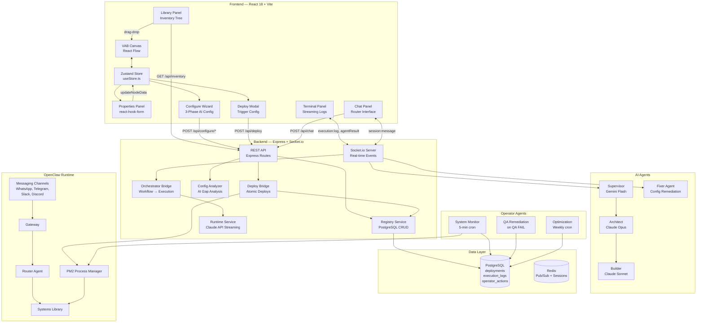
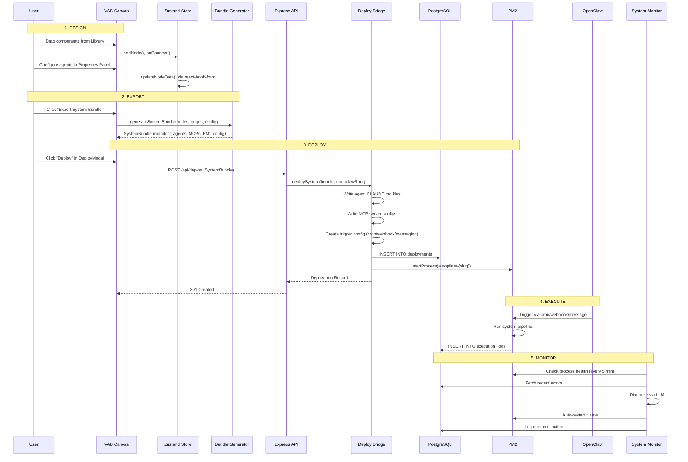

# Architecture Overview

AUTOPILATE separates **design-time intelligence** (VAB + Configure Wizard + Fixer Agent) from **runtime execution** (OpenClaw Gateway + PM2 processes + operator agents). Systems designed in the Visual Agent Builder are self-contained pipelines that OpenClaw dispatches but does not orchestrate internally.

## Component Diagram



## Folder Structure

```
autopilate/
├── src/                            # React frontend (Vite + TypeScript)
│   ├── App.tsx                     # Root layout: 3-panel + terminal + chat
│   ├── main.tsx                    # React 18 entry point
│   ├── store/
│   │   └── useStore.ts             # Zustand store — single source of truth for canvas
│   ├── components/
│   │   ├── Editor/
│   │   │   ├── Canvas.tsx          # React Flow wrapper, drag-drop, edge selection
│   │   │   ├── Toolbar.tsx         # Export, run, deploy, save/load buttons
│   │   │   ├── Nodes/             # CustomNode, DepartmentNode, AgentPoolNode, MCPServerNode
│   │   │   ├── Edges/             # DataEdge, ControlEdge, EventEdge, DelegationEdge, etc.
│   │   │   └── EdgeTypeSelector.tsx # Popup to choose edge type on new connection
│   │   ├── Library/
│   │   │   ├── LibraryPanel.tsx    # File tree with search, category tabs, add mode
│   │   │   ├── BucketView.tsx      # Capability bucket filtering
│   │   │   ├── SystemsDashboard.tsx # Gallery of deployed systems
│   │   │   └── SystemDetail.tsx    # Full system inspection view
│   │   ├── Properties/
│   │   │   ├── PropertiesPanel.tsx # Node/edge configuration panel
│   │   │   ├── DynamicForm.tsx     # Auto-sync form engine (react-hook-form)
│   │   │   ├── EdgeInspector.tsx   # Edge type inspector
│   │   │   ├── Schemas/           # Per-node-type configuration schemas
│   │   │   └── Fields/            # Reusable form field components (11 types)
│   │   ├── ConfigureWizard/
│   │   │   ├── ConfigureWizardModal.tsx  # 3-phase orchestrator
│   │   │   ├── WorkflowScanView.tsx      # Phase 1: topology scan
│   │   │   ├── NodeConfigView.tsx        # Phase 2: per-node suggestions
│   │   │   └── SummaryView.tsx           # Phase 3: review + apply
│   │   ├── Terminal/
│   │   │   ├── TerminalPanel.tsx   # Floating resizable log window
│   │   │   ├── AgentOutputBlock.tsx
│   │   │   └── ExecutionResultsPanel.tsx
│   │   ├── Chat/                   # AI chat interface (floating panel)
│   │   └── Deploy/
│   │       ├── DeployModal.tsx     # Deployment wizard
│   │       └── TriggerConfigFields.tsx
│   ├── services/
│   │   ├── api.ts                  # REST API client (inventory, deployments)
│   │   └── configureApi.ts         # Configure wizard API client
│   ├── hooks/
│   │   ├── useSocket.ts            # Socket.io client + event handlers
│   │   └── useHeadlessSession.ts   # Headless chat session wrapper
│   ├── types/
│   │   ├── core.ts                 # Node types, edge types, agent roles, configs
│   │   ├── config.ts               # WorkflowConfig, ModelProvider, defaults
│   │   ├── export.ts               # ExportFile, ExportResult, ValidationResult
│   │   └── system.ts               # DeploymentRecord, ExecutionLog
│   ├── export/
│   │   ├── bundle-generator.ts     # generateSystemBundle() — main export entry
│   │   ├── types.ts                # SystemBundle, SystemManifest, PM2 types
│   │   └── generators/vab-native/  # CLAUDE.md + agent file generators
│   ├── features/export-import/     # JSON workflow save/load
│   ├── utils/                      # Export helpers, role manager, migrations
│   ├── config/
│   │   └── edgeConfig.ts           # Edge type styling (colors, strokes, animation)
│   └── constants/                  # Taxonomy, buckets, subcategories
│
├── server/                         # Express + Socket.io backend
│   ├── src/
│   │   ├── index.ts                # Server entry: middleware, routes, Socket.io
│   │   └── middleware/
│   │       ├── auth.ts             # API key auth (timing-safe)
│   │       ├── rate-limiter.ts     # Sliding window (100/min global, 10/min AI)
│   │       ├── webhook-verify.ts   # HMAC-SHA256 signature verification
│   │       ├── validation.ts       # Zod schema validation
│   │       └── error-handler.ts    # Centralized error formatting
│   ├── routes/
│   │   ├── systems.ts              # CRUD for deployment registry
│   │   ├── deploy.ts               # Full deploy pipeline endpoint
│   │   └── operators.ts            # Operator action management + approvals
│   ├── services/
│   │   ├── deploy-bridge.ts        # Atomic deploy: canvas → OpenClaw
│   │   ├── registry.ts             # PostgreSQL CRUD + secret encryption
│   │   ├── pm2-manager.ts          # PM2 process lifecycle + status polling
│   │   ├── trigger-factory.ts      # Cron/webhook/messaging/daemon configs
│   │   ├── router-agent.ts         # Message classification + input gathering
│   │   ├── system-monitor.ts       # 5-min health check operator
│   │   ├── qa-remediation.ts       # QA failure remediation operator
│   │   ├── optimization-agent.ts   # Weekly optimization operator
│   │   ├── orchestrator-bridge.ts  # Canvas → ParsedWorkflow → execution
│   │   ├── runtime.ts              # Agent execution via Claude API
│   │   ├── configuration-analyzer.ts # AI-powered config gap analysis
│   │   ├── session-store.ts        # File-backed session persistence
│   │   ├── log-stream.ts           # WebSocket log streaming
│   │   └── inventory/              # Component scanner, parser, search, cache
│   ├── agents/
│   │   ├── supervisor.ts           # Intent routing (Gemini Flash)
│   │   ├── architect.ts            # Plan generation (Claude Opus)
│   │   └── builder.ts              # Plan execution via MCP tools (Claude Sonnet)
│   ├── socket/
│   │   ├── handlers.ts             # All Socket.io event handlers
│   │   └── emitter.ts              # Typed event emitters
│   ├── mcp/
│   │   ├── canvas/                 # Canvas MCP: create/connect/update/delete nodes
│   │   └── sandbox-mcp.ts          # Sandbox MCP: file operations
│   ├── lib/
│   │   ├── anthropic-client.ts     # Multi-workspace failover (Primary → Backup → Emergency)
│   │   ├── crypto.ts               # AES-256-GCM encryption
│   │   └── errors.ts               # Typed error hierarchy
│   ├── types/                      # Server-specific types (execution-plan, session, registry)
│   ├── migrations/                 # PostgreSQL migration files
│   ├── tests/                      # Vitest tests (deploy, router, operators, integration)
│   └── db.ts                       # PostgreSQL pool + migration runner
│
├── shared/                         # Shared types (zero imports from src/ or server/)
│   ├── socket-events.ts            # Socket.io event type definitions
│   ├── configure-types.ts          # Configure wizard types
│   └── subcategories.ts            # Category taxonomy (40+ subcategories)
│
├── docs/                           # Documentation
├── CLAUDE.md                       # Agent instructions + coding conventions
├── vite.config.ts                  # Vite config (path alias @/ → src/)
├── vitest.config.ts                # Frontend test config (jsdom)
└── tailwind.config.js              # Tailwind content scanning
```

## Data Flow: Design → Deploy → Execute → Monitor



## Key Architecture Decisions

| Decision | Choice | Rationale |
|----------|--------|-----------|
| State management | Zustand | Lightweight, selector-based, avoids re-render storms with React Flow |
| Canvas rendering | React Flow v11 | Mature node graph library with drag-drop, minimap, controls |
| Real-time comms | Socket.io | Bidirectional events for execution streaming, canvas sync |
| Server framework | Express | Simple, widely supported, paired with Socket.io |
| Database | PostgreSQL + jsonb | Relational structure for registries, flexible jsonb for configs |
| Process management | PM2 | Production Node.js process manager with monitoring, restart |
| AI failover | Multi-workspace | Primary → Backup workspace → Emergency model per role |
| Deployment | Atomic rollback | If any deploy step fails, all artifacts are cleaned up |
| Session persistence | File-backed JSON | Survives restarts, debounced writes, atomic rename |
| Form management | react-hook-form | Subscription-based updates with auto-sync to Zustand |

## Security Layers

1. **API Key Auth** — `X-API-Key` header with timing-safe comparison
2. **Rate Limiting** — Sliding window: 100 req/min global, 10 req/min for AI endpoints
3. **Webhook Verification** — HMAC-SHA256 signature validation
4. **Secret Encryption** — AES-256-GCM for deployment secrets at rest
5. **Path Traversal Protection** — Null byte rejection + path normalization + sandboxing
6. **Security Headers** — Helmet middleware
7. **CORS Locking** — Configurable origin allowlist
8. **Input Validation** — Zod schemas on all request bodies and query parameters
