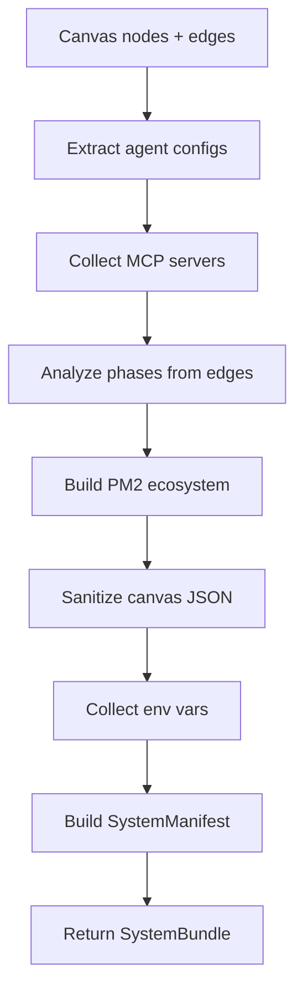
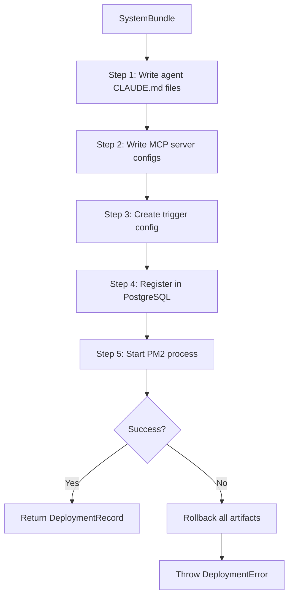
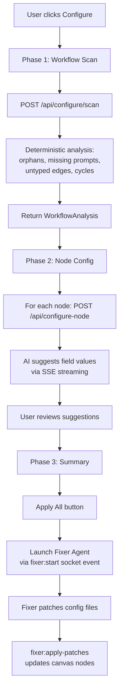

# Business Logic: Export & Deploy

## Export Bundle Generation

Converts canvas state into a deployable SystemBundle (ZIP with agents, configs, PM2 ecosystem).

### Entry Point

`src/export/bundle-generator.ts` → `generateSystemBundle(nodes, edges, workflowConfig)`

### Flow



### Key Decision Points

1. **Phase analysis** — Determines execution order by walking delegation edges from orchestrator → leaders → workers. Agents without delegation edges form their own phase.

2. **MCP deduplication** — If multiple agents reference the same MCP server, only one instance is included. Deduplication is by MCP server name.

3. **Canvas sanitization** — Before including in the bundle, React Flow internal properties are stripped: `selected`, `dragging`, `width`, `height`, `measured`, `positionAbsolute`. Only user-meaningful state is preserved.

4. **Env var collection** — Provider-specific env vars are collected from a `PROVIDER_ENV_VARS` map (e.g., Anthropic needs `ANTHROPIC_API_KEY`, OpenAI needs `OPENAI_API_KEY`).

### Output: SystemBundle

```typescript
{
  manifest: SystemManifest,        // Name, slug, inputs, trigger pattern, cost estimate
  canvasJson: object,              // Sanitized canvas snapshot
  agentConfigs: Record<string, AgentConfigSlim>,  // Per-agent configs
  mcpConfigs: MCPServerConfigSlim[],              // Deduplicated MCP servers
  pm2Ecosystem: PM2EcosystemConfig,               // PM2 process definition
  envExample: Record<string, string>,             // Required env vars
  createdAt: string
}
```

### CLAUDE.md Generation

`src/utils/generateClaudeMdExecutable.ts` generates an executable CLAUDE.md protocol from the canvas. It:
1. Infers phases from delegation edges
2. Outputs agent definitions with roles, prompts, tools
3. Generates an execution order section

### ZIP Generation

`src/utils/zipGenerator.ts` creates a ZIP file containing:
- `CLAUDE.md` — Execution protocol
- `.claude/settings.json` — Claude settings
- `agents/{slug}.md` — Per-agent config files with YAML frontmatter
- `skills/`, `commands/`, `hooks/` — Attached capabilities

---

## Deploy Bridge

Atomic deployment pipeline that translates a SystemBundle into OpenClaw runtime artifacts.

### Entry Point

`server/services/deploy-bridge.ts` → `deploySystem(bundle, openclawRoot)`

### Flow



### Step Details

**Step 1: Agent Configs** — For each agent in the bundle, creates a directory at `{openclawRoot}/agents/{systemSlug}/{agentSlug}/` and writes a `CLAUDE.md` file with the agent's name, role, system prompt, model configuration, and MCP server references.

**Step 2: MCP Configs** — Writes JSON config files to `{openclawRoot}/config/mcp/{systemSlug}/{name}.json` with the command, args, and environment variables for each MCP server.

**Step 3: Trigger Config** — Delegates to the Trigger Factory (see below). The resulting config JSON is written to `{openclawRoot}/config/triggers/{systemSlug}.json`.

**Step 4: Registry** — Calls `registerSystem(bundle)` which INSERTs into the `deployments` table. Then UPDATEs the row with `trigger_config` and `openclaw_config` (paths to the artifacts just written).

**Step 5: PM2 Start** — Takes the first app from `pm2Ecosystem.apps`, overrides the `name` to `autopilate-{slug}` and `cwd` to the OpenClaw system directory, then calls `startProcess()`. The PM2 manager polls for `online` status up to 15 seconds.

### Rollback

If **any** step fails, `rollback()` runs cleanup in reverse order:
1. Delete PM2 process (if started)
2. Mark deployment as `errored` (if registered)
3. Remove trigger config file (if written)
4. Delete MCP config directory (if created)
5. Delete agent directory (if created)

Each cleanup step catches its own errors to ensure all steps run even if some fail.

---

## Trigger Factory

Generates trigger configurations based on the system's trigger pattern.

### Entry Point

`server/services/trigger-factory.ts` → `createTriggerConfig(triggerPattern, manifest, openclawRoot)`

### Trigger Types

| Pattern | Config Shape | Defaults |
|---------|-------------|----------|
| `cron` | expression, timezone, enabled | Category-based schedule (see below) |
| `webhook` | endpointPath, method, authType | POST to `/api/webhooks/{slug}`, bearer auth |
| `messaging` | channels[], routerEnabled | Slack enabled, others disabled |
| `always-on` | healthCheckIntervalMs, endpoint | 30s interval, `/health/{slug}` |

### Cron Expression Inference

Default expressions are inferred from the system category:

| Category | Expression | Schedule |
|----------|-----------|----------|
| `monitoring` | `*/5 * * * *` | Every 5 minutes |
| `data-analysis` | `0 */6 * * *` | Every 6 hours |
| `content-production` | `0 6 * * 1-5` | Weekdays at 6 AM |
| `research` | `0 0 * * *` | Daily at midnight |
| default | `0 6 * * *` | Daily at 6 AM |

### Output

The trigger config is written as JSON to `{openclawRoot}/config/triggers/{slug}.json` and also stored in the `trigger_config` JSONB column of the deployments table.

---

## Configure Wizard + Fixer Agent

Three-phase AI-powered configuration analysis that identifies gaps and suggests fixes.

### Entry Point

`src/components/ConfigureWizard/ConfigureWizardModal.tsx` (frontend orchestrator)
`server/services/configuration-analyzer.ts` (backend analysis)

### Flow



### Phase 1: Workflow Scan (deterministic)

Checks performed by `analyzeWorkflow()`:
- Empty canvas (no nodes)
- Orphan agents (no incoming or outgoing edges)
- Untyped edges (missing edge type)
- Cycle detection in delegation graph
- Per-node checks: agents need systemPrompt + model, MCPs need command, skills need content
- Cost estimation: $0.15 per node

### Phase 2: Node Config (AI-powered)

`analyzeNodeConfig()` streams suggestions via SSE:
1. Masks secrets in node config (env vars matching `/key|token|secret|password|credential|auth/i`)
2. Sends node context to Claude (BUILDER role)
3. Streams chunks back to client
4. Returns `ConfigSuggestion` with per-field recommendations (field, currentValue, suggestedValue, reason, priority)

### Phase 3: Summary + Fixer

The Fixer Agent receives a prompt compiled from all unresolved suggestions. It runs via the Claude Code CLI (or Anthropic API fallback), writes patches to `fixes/config-patches.json`, which are then applied to canvas nodes via the `fixer:apply-patches` socket event.

The wizard state is cached in `store.configureWizardCache` so reopening the modal restores progress.
