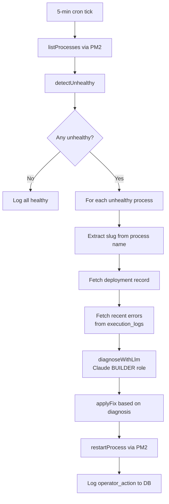
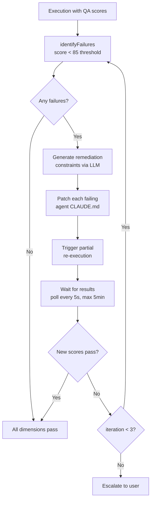
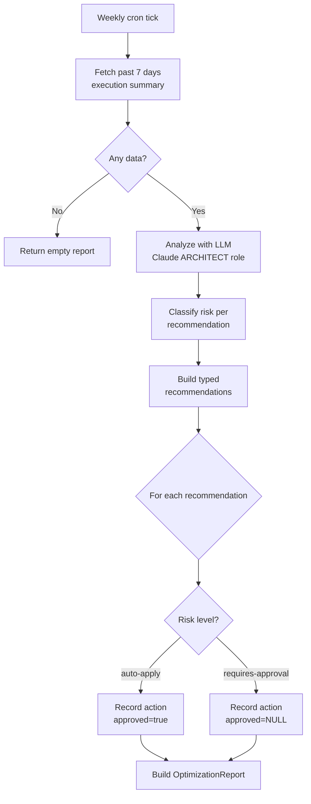

# Business Logic: Operator Agents

Three operator agents form the self-healing layer. They are themselves AUTOPILATE systems running on OpenClaw.

## System Monitor

Detects unhealthy processes, diagnoses root causes via LLM, and applies fixes.

### Entry Point

`server/services/system-monitor.ts` → `runSystemMonitor()`

Registered as a 5-minute cron via `registerMonitorCron()`.

### Flow



### Unhealthy Detection Criteria

A PM2 process is flagged as unhealthy if **any** of:
- Status is `errored` or `stopped`
- Restart count >= 10
- Crash-looping: restarts > 3 AND uptime < 30 seconds

### Diagnosis Categories

The LLM classifies the root cause into one of 7 categories:

| Kind | Auto-fix? | Action |
|------|-----------|--------|
| `expired_key` | If backup keys exist | Note failover chain active; or flag for manual rotation |
| `rate_limit` | Yes | Add fallback model to failover chain in `openclaw_config` |
| `timeout` | Yes | Double timeout value (max 600s) in `openclaw_config` |
| `oom` | Yes | Double memory limit (max 4096M) in `openclaw_config` |
| `malformed_config` | No | Flag for manual review |
| `dependency_failure` | No | Flag for manual review |
| `unknown` | No | Restart process, flag for review |

### Auto-fix Details

**Rate limit fix** — Updates `openclaw_config` with:
```json
{ "fallbackModel": "claude-3-7-sonnet-20250219", "rateLimitMitigation": true }
```

**Timeout fix** — Doubles current timeout (default 120s → 240s, capped at 600s):
```json
{ "timeoutMs": 240000 }
```

**OOM fix** — Doubles memory limit (default 256M → 512M, capped at 4096M):
```json
{ "maxMemoryRestart": "512M" }
```

### Error Context

Fetches up to 20 recent failed execution logs from the past hour for the affected deployment. Error messages are concatenated and sent to the LLM for diagnosis.

---

## QA Remediation Agent

Activates on QA FAIL events. Identifies failed quality dimensions, patches responsible agents, and re-executes only affected phases. Max 3 iterations.

### Entry Point

`server/services/qa-remediation.ts` → `runQaRemediation(executionLog)`

### Flow



### Quality Dimensions

7 dimensions evaluated by the QA auditor:

| Dimension | Responsible Agent | Score Range |
|-----------|-------------------|-------------|
| Technical Quality | `frontend-engineer` | 0-100 |
| Accessibility | `ux-ui-architect` | 0-100 |
| SEO | `perf-seo-engineer` | 0-100 |
| Strategic Alignment | `strategist` | 0-100 |
| Copy Quality | `copywriter` | 0-100 |
| Brand Consistency | `brand-designer` | 0-100 |
| UX/Usability | `ux-ui-architect` | 0-100 |

Pass threshold: **85/100**

### Constraint Injection

The LLM (ARCHITECT role) generates targeted constraints for each failed dimension. For example, if Accessibility scores 60:

> "Ensure all images have descriptive alt text, all form inputs have associated labels, and color contrast ratios meet WCAG 2.1 AA standards (4.5:1 for normal text)."

The constraint is appended to the agent's `CLAUDE.md` file under a `## QA Remediation Constraints` section. If this section already exists, it's replaced.

### Partial Re-execution

Only affected phases are re-run:
1. INSERT a new `execution_logs` row with `triggered_by = 'qa-remediation'`
2. UPDATE deployment `openclaw_config` with `partialReRun: { agentSlugs, executionId }`
3. Poll `execution_logs` every 5 seconds for completion (max 5 minutes)
4. If new scores pass → done. If not → iterate.

### Escalation

After 3 iterations, if dimensions still fail, an `escalate` action is recorded with `autoApplied = false`, requiring manual intervention. The escalation message includes all still-failing dimensions and their scores.

---

## Optimization Agent

Weekly cron that analyzes execution history and generates cost, reliability, and quality recommendations.

### Entry Point

`server/services/optimization-agent.ts` → `runOptimizationAgent()`

### Flow



### Recommendation Categories

| Category | Data Points | Example Recommendation |
|----------|------------|----------------------|
| **Cost** | avg_cost_usd, total_cost_usd, model_usage | "Downgrade from Opus to Sonnet for systems with QA > 0.9" |
| **Reliability** | failure_count, timeout_count | "Increase timeout for systems with >10% timeout rate" |
| **Quality** | avg_qa_score | "Add output validation for systems with declining QA" |

### Risk Classification Rules

| Category | Condition | Risk Level |
|----------|-----------|------------|
| Cost | Monthly savings <= $20 | `auto-apply` |
| Cost | Monthly savings > $20 | `requires-approval` |
| Reliability | Timeout/retry changes | `auto-apply` |
| Reliability | Structural changes | `requires-approval` |
| Quality | Any change | `requires-approval` |

The auto-apply cost threshold is `AUTO_APPLY_COST_THRESHOLD_USD = 20`.

### Execution Summary Query

Aggregates per-deployment from `execution_logs` for the past 7 days:
- Total executions
- Average and total cost
- Average duration
- Failure count and timeout count
- Average QA score
- Model usage distribution

Only includes non-archived deployments.

### Approval Workflow

Auto-applied actions (low-risk) are immediately recorded with `approved = true`. High-risk actions are recorded with `approved = NULL` (pending). Users review pending actions via the `GET /api/operators/actions/pending` endpoint and approve/reject via `POST /api/operators/actions/:id/approve` or `/reject`.

When approved:
1. Optimization config is merged into deployment's `openclaw_config`
2. PM2 process is restarted to pick up changes

### Output: OptimizationReport

```typescript
{
  generatedAt: string,
  periodStart: string,        // 7 days ago
  periodEnd: string,          // Now
  totalExecutions: number,
  totalCostUsd: number,
  recommendations: OptimizationRecommendation[],
  autoAppliedCount: number,
  pendingApprovalCount: number
}
```

---

## Orchestrator Bridge

Converts canvas state to an executable workflow and runs it via Claude API.

### Entry Point

`server/services/orchestrator-bridge.ts` → `executeWorkflow(sessionId, nodes, edges, brief)`

### Flow

1. **Validation** — Check for empty canvas, orphan agents, cycles
2. **MCP server initialization** — Start required MCP servers
3. **Agent pool setup** — Configure agents with their tools and models
4. **Phase execution** — Run agents in order (respecting delegation edges) or parallel
5. **QA evaluation** — Score output across quality dimensions
6. **Report generation** — Aggregate costs, tokens, duration into ExecutionReport

### Streaming

All execution output is streamed to the client via Socket.io:
- `execution:log` — Real-time text output (stdout/stderr)
- `execution:stepStart` / `execution:stepComplete` — Phase progress
- `execution:agentResult` — Per-agent completion with metrics
- `execution:report` — Final summary

A `StreamLogger` bridges internal logging to Socket.io events.
