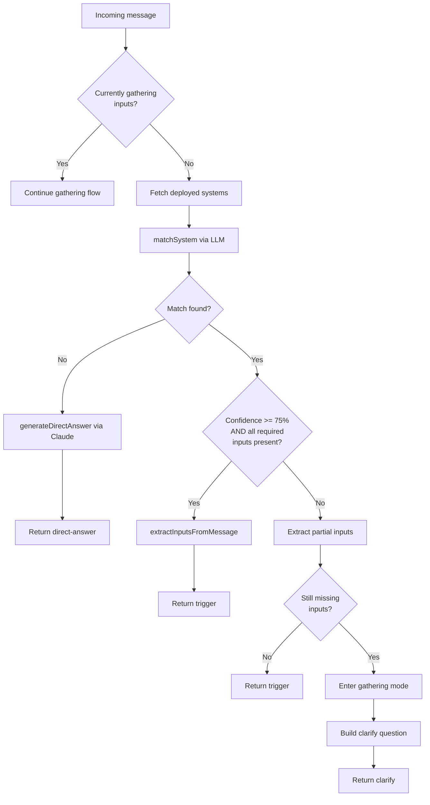
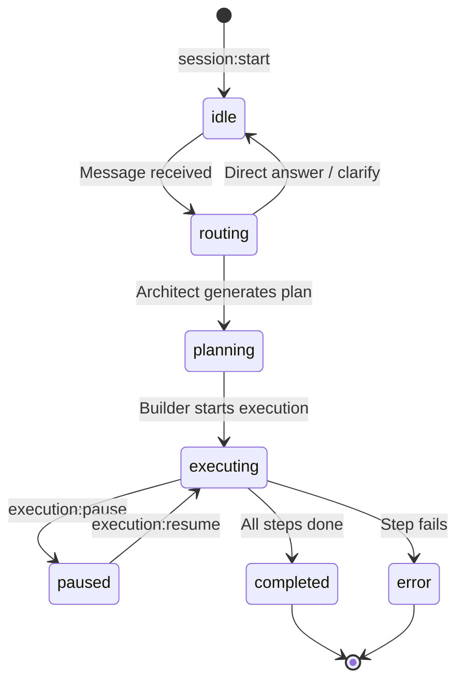
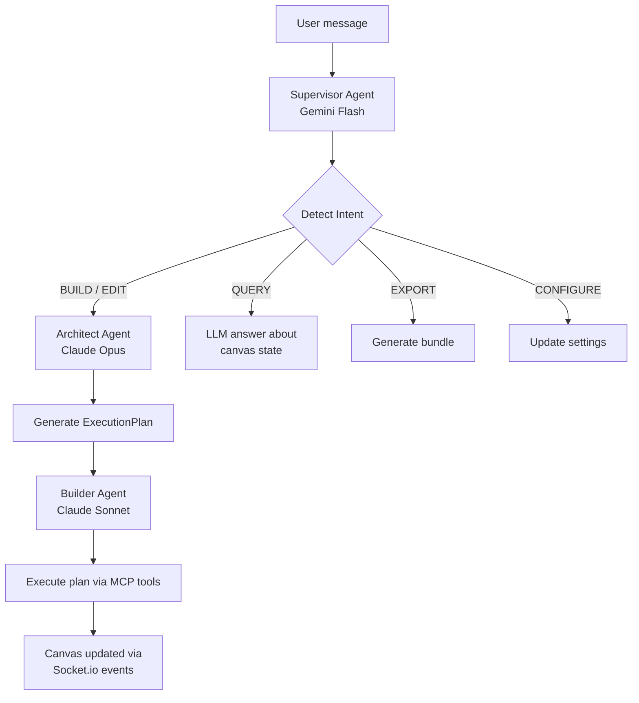

# Business Logic: Router & Session Management

## Router Agent Classification

The Router Agent sits between OpenClaw messaging channels and the Systems Library. It classifies inbound messages into one of three actions.

### Entry Point

`server/services/router-agent.ts` → `RouterAgent.handleMessage(message)`

### Decision Types

```typescript
type RouterDecision =
  | { kind: 'direct-answer'; response: string }   // No system match
  | { kind: 'clarify'; system; missingInputs[]; question }  // Match, need more info
  | { kind: 'trigger'; system; inputs }            // Match with all inputs
```

### Flow



### Key Decision Points

1. **Confidence threshold** — Messages need >= 75% confidence (`HIGH_CONFIDENCE_THRESHOLD`) to trigger without clarification. Below that, the router enters gathering mode.

2. **Gathering state** — The router maintains per-session state. Once a system is matched, follow-up messages are routed to `handleGatheringResponse()` which extracts additional inputs and checks if all required inputs are now present.

3. **System matching** — Uses `matchSystem()` from `system-matcher.ts` which compares the message against all deployed system manifests using LLM classification.

4. **Input extraction** — `extractInputsFromMessage()` uses Claude (BUILDER role) with a structured prompt that lists already-collected inputs and still-needed inputs. Returns a JSON map of extracted values. Falls back to empty object on parse failure.

### LLM Functions (isolated for mocking)

| Function | LLM Role | Purpose |
|----------|----------|---------|
| `generateDirectAnswer(message)` | BUILDER | Answer questions not matched to any system |
| `extractInputsFromMessage(message, system, collected)` | BUILDER | Extract structured inputs from natural language |

### Socket Side Effects

The router emits real-time updates during processing:
- `session:stateChange` with state `routing` when processing begins
- `session:message` with router responses
- `execution:log` with diagnostic messages
- `session:stateChange` with state `idle` when processing completes

---

## Input Gathering

Multi-turn conversational flow for collecting missing system inputs.

### How It Works

1. Router matches message to a system but detects missing required inputs
2. Router extracts any inputs already present in the message via LLM
3. Remaining missing inputs are tracked in `GatheringState`
4. Router generates a clarify question listing each missing input with its type and description
5. Next message from user goes through `handleGatheringResponse()`
6. LLM extracts new values, merges into collected inputs
7. If all collected → trigger. If still missing → ask again.

### Clarify Question Format

```
I can run **Content Pipeline** for you, but I need a bit more info:

- **topic** (string): The blog post topic
- **tone** (string): Writing tone (formal, casual, technical)

Please provide the missing details.
```

### State Management

```typescript
interface GatheringState {
  system: SystemManifest;           // Matched system
  collectedInputs: Record<string, string>;  // Inputs gathered so far
  remainingInputs: string[];        // Input names still needed
}
```

The gathering state is reset when:
- All inputs are collected and system is triggered
- `resetGatheringState()` is called explicitly
- A new session starts

---

## Session Management

File-backed session persistence for multi-turn conversations.

### Entry Point

`server/services/session-store.ts` → `FileSessionStore`

### Session Lifecycle



### Session Schema

```typescript
interface Session {
  id: string;
  state: SessionState;
  createdAt: number;
  updatedAt: number;
  messages: SessionMessage[];
  currentPlanId?: string;
  currentStepIndex?: number;
  variables: Record<string, string>;
  canvasSnapshot?: { nodes: []; edges: [] };
}
```

### Persistence Strategy

- **Storage**: JSON file at `data/sessions.json` (configurable via `SESSIONS_PATH`)
- **Write debounce**: 500ms — batches rapid updates into a single disk write
- **Atomic writes**: Writes to `.tmp` file, then renames to final path (prevents corruption)
- **Shutdown flush**: On SIGTERM/SIGINT, `flush()` persists immediately
- **Survives restarts**: Sessions are restored on server startup

### Key Methods

| Method | Description |
|--------|-------------|
| `get(sessionId)` | Retrieve a session |
| `set(sessionId, session)` | Store/update a session |
| `delete(sessionId)` | Remove a session |
| `updateState(sessionId, state)` | Transition session state |
| `addMessage(sessionId, message)` | Append a message |
| `setVariable(sessionId, key, value)` | Store execution variable |

---

## Chat Agent Pipeline

Three-agent hierarchy for processing user messages in the chat panel.

### Entry Point

`server/agents/supervisor.ts` → `SupervisorAgent.processMessage(message, session)`

### Flow



### Intent Types

| Intent | Trigger | Handler |
|--------|---------|---------|
| `BUILD` | "Create", "Add", "Make" | Creates Architect → Builder pipeline |
| `EDIT` | "Change", "Update", "Modify" | Same as BUILD but with existing context |
| `QUERY` | "What", "How", "Why" | LLM answers about current canvas |
| `EXPORT` | "Export", "Download", "Save" | Generates system bundle |
| `CONFIGURE` | "Set", "Configure", "Change setting" | Updates workflow config |
| `UNKNOWN` | Fallback | Generic LLM response |

### Supervisor Intent Detection

Primary: Gemini 2.0 Flash API for fast classification.
Fallback: Keyword-based matching if Gemini unavailable.

### Architect Plan Generation

Uses Claude Opus (16k token output) with a structured system prompt. Outputs a JSON `ExecutionPlan` with steps that reference actions:
- `CREATE_NODE` — Add a node to the canvas
- `CONNECT_NODES` — Create an edge between nodes
- `UPDATE_NODE` — Modify node properties
- `DELETE_NODE` — Remove a node
- `CREATE_FILE` — Create a file in the sandbox
- `REGISTER_CAPABILITY` — Register a skill/hook/command

Steps can reference outputs of previous steps using `${variable_name}` syntax.

### Builder Plan Execution

Uses Claude Sonnet (8k tokens) with MCP tools:
- `canvas_create_node`, `canvas_connect_nodes`, `canvas_update_property`, `canvas_delete_node`
- `sandbox_create_file`, `sandbox_read_file`, `sandbox_list_directory`

Execution respects step dependencies (waits for dependent steps to complete). Max 3 retries per step with 1s delay. Emits Socket.io events for real-time progress tracking.
