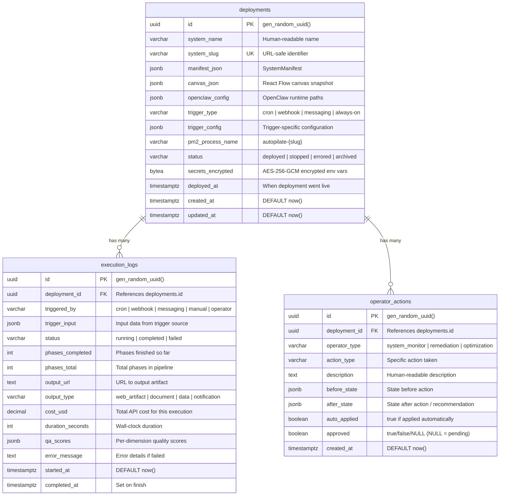

# Data Model

## ER Diagram



## Table: `deployments`

The deployment registry. Each row represents one deployed system.

| Column | Type | Constraints | Description | Example |
|--------|------|-------------|-------------|---------|
| `id` | uuid | PK, DEFAULT gen_random_uuid() | Unique identifier | `550e8400-...` |
| `system_name` | varchar | NOT NULL | Human-readable name | `Content Pipeline` |
| `system_slug` | varchar | UNIQUE, NOT NULL | URL-safe identifier | `content-pipeline` |
| `manifest_json` | jsonb | NOT NULL | SystemManifest (see below) | `{"name":"..."}` |
| `canvas_json` | jsonb | NOT NULL | Full React Flow canvas state | `{"nodes":[],"edges":[]}` |
| `openclaw_config` | jsonb | | OpenClaw runtime path references | `{"agentDir":"agents/..."}` |
| `trigger_type` | varchar | NOT NULL | Trigger pattern | `cron` |
| `trigger_config` | jsonb | | Trigger-specific configuration | `{"expression":"0 6 * * *"}` |
| `pm2_process_name` | varchar | | PM2 process identifier | `autopilate-content-pipeline` |
| `status` | varchar | NOT NULL, DEFAULT 'deployed' | Current state | `deployed` |
| `secrets_encrypted` | bytea | | AES-256-GCM encrypted env vars | (binary) |
| `deployed_at` | timestamptz | | When deployment went live | `2026-02-20T...` |
| `created_at` | timestamptz | DEFAULT now() | Row creation time | |
| `updated_at` | timestamptz | DEFAULT now() | Last modification | |

### JSONB: `manifest_json` (SystemManifest)

```json
{
  "name": "Content Pipeline",
  "slug": "content-pipeline",
  "description": "Weekly blog post generator",
  "version": "1.0.0",
  "category": "content-production",
  "requiredInputs": [
    { "name": "topic", "type": "string", "description": "Blog topic", "required": true }
  ],
  "outputType": "document",
  "estimatedCostUsd": 0.50,
  "triggerPattern": "cron",
  "nodeCount": 4,
  "edgeCount": 3
}
```

Categories: `web-development`, `content-production`, `research`, `data-analysis`, `monitoring`

Output types: `web_artifact`, `document`, `data`, `notification`

### JSONB: `canvas_json`

Sanitized React Flow canvas (transient properties like `selected`, `dragging`, `measured` are stripped before storage). Contains `nodes[]` and `edges[]` arrays.

### JSONB: `openclaw_config`

```json
{
  "agentDir": "agents/content-pipeline",
  "mcpDir": "config/mcp/content-pipeline",
  "triggerFile": "config/triggers/content-pipeline.json",
  "fallbackModel": "claude-3-7-sonnet-20250219",
  "timeoutMs": 120000,
  "maxMemoryRestart": "256M",
  "rateLimitMitigation": false,
  "partialReRun": { "agentSlugs": ["writer"], "executionId": "..." },
  "approvedOptimization": {}
}
```

Fields are added dynamically by operator agents (System Monitor, QA Remediation, Optimization).

### JSONB: `trigger_config`

Depends on `trigger_type`:

**Cron:**
```json
{ "type": "cron", "expression": "0 6 * * 1-5", "timezone": "UTC", "enabled": true }
```

**Webhook:**
```json
{ "type": "webhook", "endpointPath": "/api/webhooks/content-pipeline", "method": "POST", "authType": "bearer", "enabled": true }
```

**Messaging:**
```json
{
  "type": "messaging",
  "channels": [
    { "platform": "whatsapp", "enabled": false },
    { "platform": "telegram", "enabled": false },
    { "platform": "slack", "enabled": true },
    { "platform": "discord", "enabled": false }
  ],
  "routerEnabled": true,
  "enabled": true
}
```

**Daemon (always-on):**
```json
{ "type": "always-on", "healthCheckIntervalMs": 30000, "healthCheckEndpoint": "/health/content-pipeline", "enabled": true }
```

### Secret Encryption

Secrets are encrypted with AES-256-GCM before storage in `secrets_encrypted`:
- Key: 32 bytes from `ENCRYPTION_KEY` env var (64 hex chars)
- Format: `base64(IV[12 bytes] + AuthTag[16 bytes] + Ciphertext)`
- Decrypted on read by the registry service

---

## Table: `execution_logs`

Append-only log of every workflow execution. Indexed on `deployment_id`.

| Column | Type | Constraints | Description | Example |
|--------|------|-------------|-------------|---------|
| `id` | uuid | PK, DEFAULT gen_random_uuid() | Unique identifier | |
| `deployment_id` | uuid | FK → deployments.id | Parent system | |
| `triggered_by` | varchar | | Trigger source | `cron` |
| `trigger_input` | jsonb | | Input data from trigger | `{"topic":"AI"}` |
| `status` | varchar | DEFAULT 'running' | Execution state | `completed` |
| `phases_completed` | int | | Finished phase count | `3` |
| `phases_total` | int | | Total phase count | `4` |
| `output_url` | text | | URL to output artifact | `https://...` |
| `output_type` | varchar | | Output format | `document` |
| `cost_usd` | decimal | | Total API cost | `0.45` |
| `duration_seconds` | int | | Wall-clock time | `120` |
| `qa_scores` | jsonb | | Quality dimension scores | See below |
| `error_message` | text | | Error details | `Rate limit exceeded` |
| `started_at` | timestamptz | DEFAULT now() | Execution start | |
| `completed_at` | timestamptz | | Execution end | |

### JSONB: `qa_scores`

```json
{
  "overall": 87,
  "Technical Quality": 92,
  "Accessibility": 78,
  "SEO": 85,
  "Strategic Alignment": 90,
  "Copy Quality": 88,
  "Brand Consistency": 91,
  "UX/Usability": 82
}
```

Scores are 0-100. The QA Remediation agent activates when any dimension falls below 85.

---

## Table: `operator_actions`

Log of all actions taken by operator agents. Indexed on `deployment_id`.

| Column | Type | Constraints | Description | Example |
|--------|------|-------------|-------------|---------|
| `id` | uuid | PK, DEFAULT gen_random_uuid() | Unique identifier | |
| `deployment_id` | uuid | FK → deployments.id | Affected system | |
| `operator_type` | varchar | NOT NULL | Agent type | `system_monitor` |
| `action_type` | varchar | NOT NULL | Specific action | `increase_timeout` |
| `description` | text | | Human-readable summary | `Timeout increased...` |
| `before_state` | jsonb | | State snapshot before | `{"status":"errored"}` |
| `after_state` | jsonb | | State snapshot after / recommendation | `{"diagnosis":{}}` |
| `auto_applied` | boolean | NOT NULL | Was this auto-applied? | `true` |
| `approved` | boolean | | Approval status (NULL=pending) | `null` |
| `created_at` | timestamptz | DEFAULT now() | When action was taken | |

### Operator Types and Action Types

**system_monitor:**
- `key_rotation_available` — Backup API keys present, failover active (auto)
- `key_rotation_needed` — No backups, manual rotation required (manual)
- `add_fallback_model` — Added emergency model to failover chain (auto)
- `increase_timeout` — Doubled timeout value (auto)
- `increase_memory` — Doubled PM2 memory limit (auto)
- `flag_config_error` — Malformed config detected (manual)
- `flag_dependency` — External dependency failure (manual)
- `flag_unknown` — Unknown issue, process restarted (manual)

**remediation:**
- `patch` — Injected QA constraint into agent system prompt (auto)
- `re-execute` — Triggered partial re-execution of affected phases (auto)
- `escalate` — Max iterations exhausted, manual intervention needed (manual)

**optimization:**
- `cost` — Model downgrade or batching recommendation
- `reliability` — Timeout/retry policy change
- `quality` — Prompt constraint or model upgrade suggestion

### Approval Workflow

- `approved = NULL` → Pending review
- `approved = true` → Approved and applied (config merged, PM2 restarted)
- `approved = false` → Rejected

---

## Redis Usage

Redis is used for pub/sub messaging and caching. Key patterns:

| Pattern | Purpose |
|---------|---------|
| `session:{sessionId}` | Active session state cache |
| `inventory:cache` | Cached inventory tree (invalidated on file change) |
| `execution:{executionId}:logs` | Streaming execution log buffer |

Redis subscriber connections are dedicated (cannot run GET/SET). The application uses separate connections for pub/sub vs. key-value operations.

---

## Session Storage (File-based)

Persisted to `data/sessions.json` (configurable via `SESSIONS_PATH`). Each session contains `id`, `state`, `messages[]`, `variables`, and optional `canvasSnapshot`. Write strategy: debounced (500ms), atomic (write `.tmp` then rename). Flushed on SIGTERM/SIGINT.

## Migrations

Files in `server/migrations/` export `up(client)` and `down(client)`. Tracked in `_migrations` table. Run: `cd server && npm run migrate`

Current: `20260219_000001_initial_schema.ts` — Creates all three tables with indexes.
